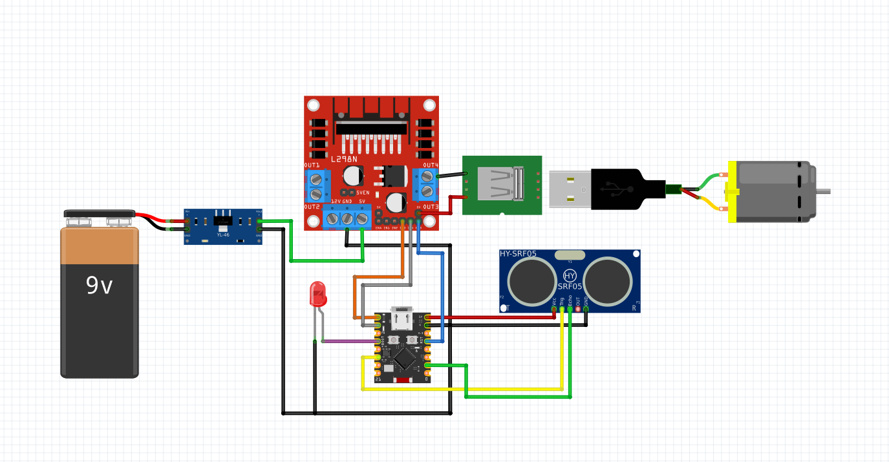

# 🐱 Automatic Pet Water Fountain - IoT Project



An intelligent IoT-based automatic water pump control system designed for pet water fountains. This project combines ESP32-C3 microcontroller with an Android mobile application to provide seamless remote control and automated operation through ultrasonic sensor detection.

## 🌟 Overview

This project creates a smart water pump system that automatically activates when it detects a pet (or any object) approaching the water fountain. The system can be controlled remotely via a mobile app, supports scheduled operation, and works independently even without internet connectivity.

## ✨ Key Features

### 🤖 Automated Operation
- **Ultrasonic Sensor Detection**: Automatically activates the pump when an object is detected within 20cm for 2 seconds
- **Auto Shut-off**: Pump automatically turns off when the object moves away
- **Offline Operation**: Sensor-based automation works independently without WiFi/MQTT connection

### 📱 Remote Control (Android App)
- **Real-time Control**: Turn pump ON/OFF instantly from anywhere
- **Timer Mode**: Set automatic shut-off timer (hours and minutes)
- **Status Monitoring**: Real-time status updates via MQTT
- **Terminal View**: View detailed logs and system events
- **Auto Reconnect**: Automatic reconnection when connection is lost

### ⏰ Smart Scheduling
- **Timer Priority**: Timer mode takes priority over sensor mode
- **Independent Operation**: Timer continues even if WiFi disconnects (uses millis())
- **Status Updates**: Periodic status updates showing remaining time

### 🔌 Hardware Integration
- **5V Motor Control**: Designed for 5V DC motors (water pumps)
- **LED Indicator**: Visual feedback when pump is running
- **Motor Driver**: Compatible with standard motor control modules

## 🎯 Why This Project?

### Problem Solved
Traditional pet water fountains require manual operation or run continuously, wasting water and electricity. This project provides:
- **Water Conservation**: Only runs when needed (pet detected)
- **Energy Efficiency**: Automatic shut-off prevents unnecessary operation
- **Convenience**: Remote control from anywhere via smartphone
- **Reliability**: Works offline with sensor-based automation

### Use Cases
- Pet water fountains (cats, dogs, small animals)
- Automated irrigation systems
- Smart home water features
- Educational IoT projects

## 🏗️ Architecture

### Hardware Components
- **ESP32-C3 Super Mini**: Main microcontroller with WiFi capability
- **Ultrasonic Sensor (HC-SR04)**: Object detection
- **Motor Control Module**: 5V DC motor driver
- **5V DC Motor**: Water pump
- **LED Indicator**: Status visualization

### Software Stack
- **ESP32 Firmware**: Arduino-based firmware with WiFi/MQTT support
- **Android Application**: Native Android app using MQTT protocol
- **MQTT Broker**: Cloud-based message broker (HiveMQ)

## 🔄 How It Works

1. **Sensor Mode (Default)**:
   - Ultrasonic sensor continuously monitors distance
   - When object detected < 20cm for 2 seconds → Pump turns ON
   - When object moves away → Pump turns OFF

2. **Timer Mode**:
   - User sets timer via Android app
   - Pump runs for specified duration
   - Automatically switches back to sensor mode when timer ends

3. **Remote Control**:
   - Android app connects to MQTT broker
   - Commands sent to ESP32 via MQTT topics
   - Real-time status updates received from ESP32

## 📊 Technical Specifications

- **Microcontroller**: ESP32-C3 (RISC-V, 160MHz)
- **Communication**: WiFi 802.11 b/g/n, MQTT Protocol
- **Sensor**: Ultrasonic HC-SR04 (2-400cm range)
- **Motor**: 5V DC motor (via motor control module)
- **Power**: 5V USB for ESP32, 7.4V battery for motor
- **MQTT Broker**: HiveMQ Cloud (free public broker)

## 🎨 Project Structure

```
may-uong-nuoc/
├── may-uong-nuoc-meo-meo/     # ESP32 firmware (Arduino)
│   └── may-uong-nuoc-meo-meo.ino
├── app/                        # Android application
│   ├── src/main/java/         # Java source code
│   └── build.gradle.kts       # Build configuration
└── may-bom-nuoc-meo-meo.png   # Project image
```

## 🚀 Getting Started

### ESP32 Setup
1. Flash firmware to ESP32-C3
2. Configure WiFi credentials in code
3. Connect hardware components
4. Upload to ESP32

### Android App Setup
1. Open project in Android Studio
2. Sync Gradle dependencies
3. Build and install on Android device
4. Connect to MQTT broker

## 💡 Key Innovations

- **Dual Mode Operation**: Seamless switching between sensor and timer modes
- **Offline Resilience**: Core functionality works without internet
- **Real-time Feedback**: Instant status updates via MQTT
- **User-Friendly**: Simple Android interface for all controls
- **Energy Efficient**: Only operates when needed

## 🔮 Future Enhancements

- Water level sensor integration
- Multiple pump support
- Scheduling calendar (daily/weekly schedules)
- Water consumption statistics
- Multi-device support (multiple fountains)

## 📝 License

Open source project - free to use and modify.

---

**Built with ❤️ for pet owners who want smart, automated water solutions**
